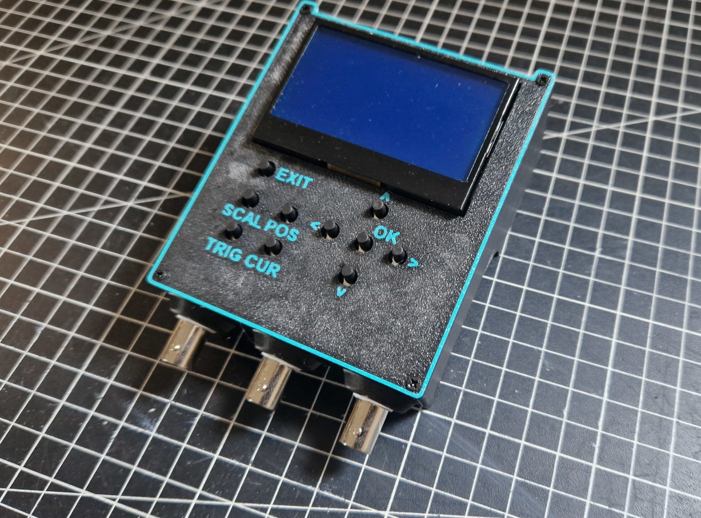
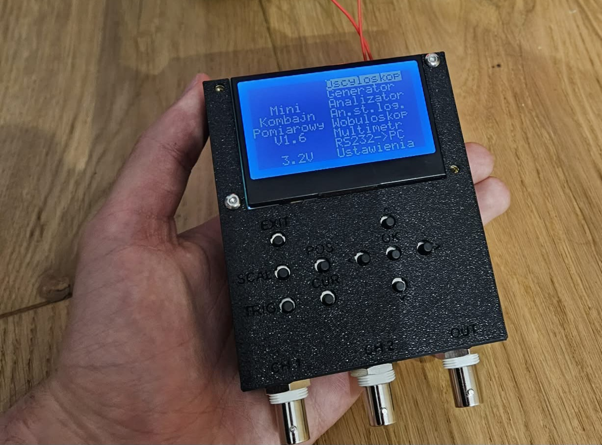

 

  
  

## Wskrzeszenie projektu Mini Kombajn Pomiarowy od AVT
### Kompilacja Kodu
Do kompilacji i wgrywania kodu użyto odpowiednio MPLAB X IDE i MPLAB IPE  
W pobranym repo należy utworzyć projekt MPLAB i następnie dodać pliki źródłowe i nagłówkowe  
Choose project -> microchip embedded -> ATXMEGA32A4 (A4U, trzeba zportować niektóre rzeczy pod A4U) -> X8C (v3.10)  
Properties -> X8C Compiler -> define macros: F_CPU=32000000UL oraz additional options: -mconst-data-in-progmem  

### Obudowa
Zostały stworzone dwie obudowy:
- Pierwsza wersja, prostrza, bez potrzebu dodatkowego przerabiania płytki, oraz możliwa do wydrukowania na podstawowych drukarkach znajduje się w folderze [case/V1-simple_noBattery](./case/V1-simple_noBattery)
- Druga wersja, bardziej zaawansowana, z wbudowanym układem na zasilanie z baterii 9V oraz jedna częśc wymaga drukarki z funckją mulitcolor znajduje się w folderze [case/V2-advanced_battery_multicolor](./case/V2-advanced_battery_multicolor), [instrukcja do tej obudowy](./case/V2-advanced_battery_multicolor/case.md)\

Obie obudowy posiadają pliki .f3d z programu Fusion360, druga wersja posiada również pliki .step
