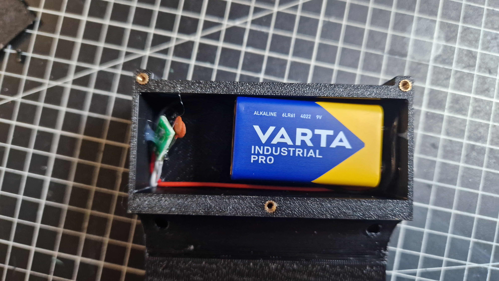
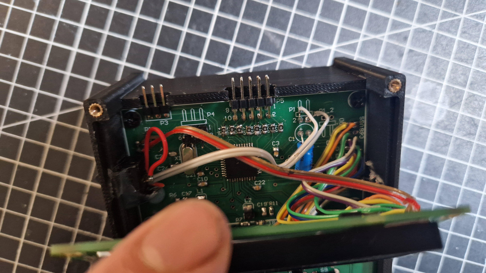
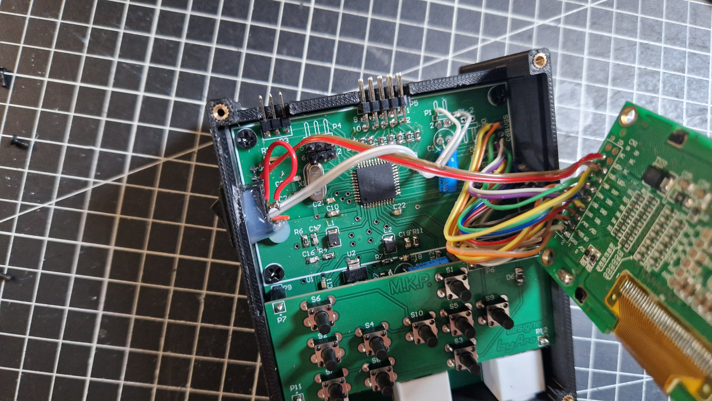

  

  

## Druga wersja obudowy do projektu MKP
### Potrzebne elementy
- 7x heatinsert M2
- 4x heatinsert M3
- Śruby odpowiadające heatinsert'om (7x M2, 4x M3)
- Złącze na baterię 9V
- Przełącznik typu rocker switch pasujący do otworu o wymiarach ok. 12.5x9mm
- Regulator napięcia 3.3V, np AMS1117 3.3V
- Wydrukowane elementy, górna część została zaprojektowana z myślą o druku multicolor

### Skłdanie obudowy
#### W dolnej części obudowy znajduje się miejsce na baterię 9V oraz na regulator napięcia

  

  
#### Kable które wychodzą z regulatora należy przeciągnąć pod płytką aż do przełącznika

  

  

  

  
